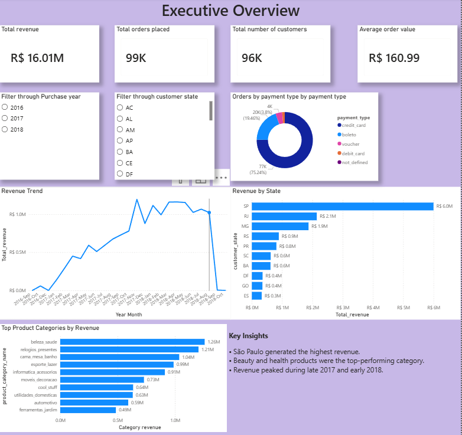
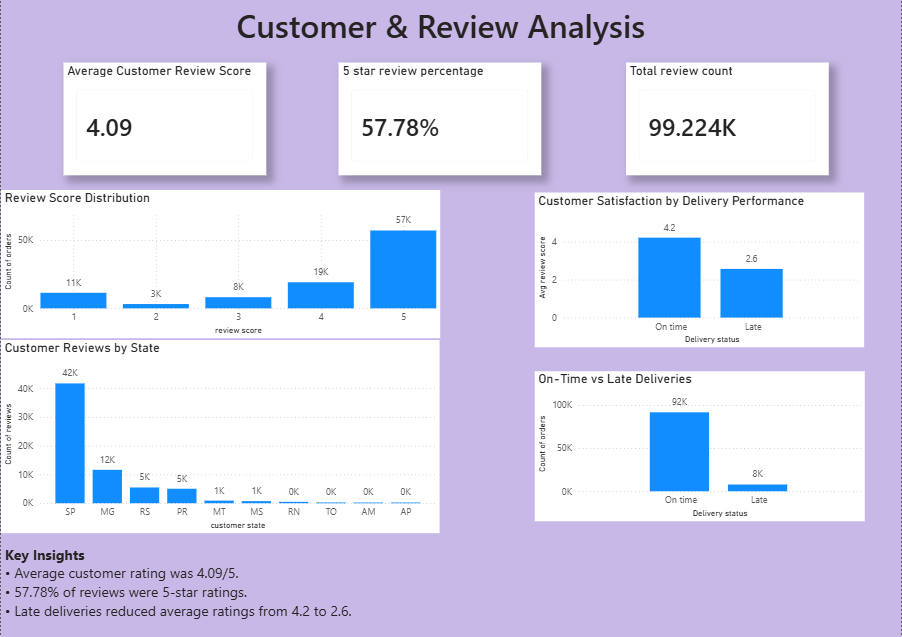
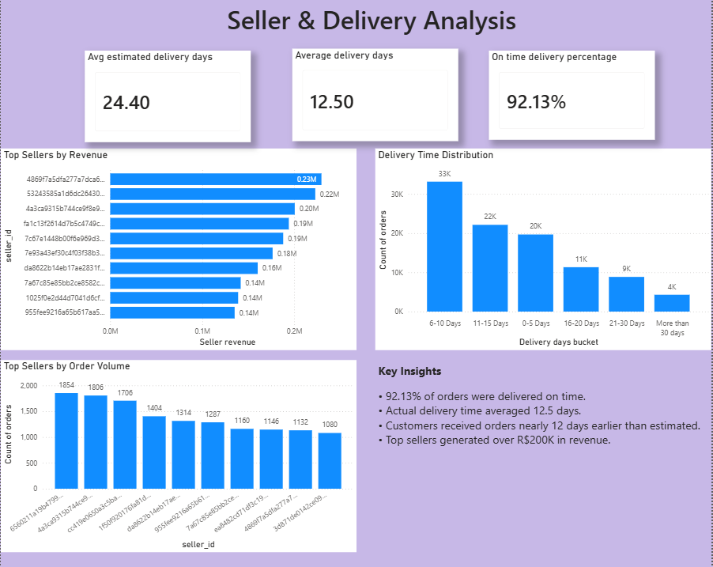

# Brazilian-Ecommerce-Analytics
End-to-end Data Analytics project using SQL and Power BI on the Olist Brazilian E-commerce dataset.
# Brazilian E-Commerce Analytics Dashboard

## Project Overview

This project analyzes the Brazilian Olist E-Commerce dataset to uncover business insights related to revenue performance, customer behavior, seller performance, delivery efficiency, and customer satisfaction.

The analysis was conducted using SQL for data exploration and Power BI for interactive dashboard development.

---

## Tools & Technologies

* SQL Server
* Power BI
* DAX
* Data Modeling
* Data Visualization
* Business Intelligence Reporting

---

## Dataset

The dataset contains information about:

* Customers
* Orders
* Payments
* Products
* Sellers
* Reviews
* Delivery Performance

Source: Olist Brazilian E-Commerce Public Dataset

---

## Business Questions Answered

### Revenue Analysis

* How much revenue was generated?
* Which states generated the highest revenue?
* Which product categories performed best?
* How did revenue trend over time?

### Customer Analysis

* What is the repeat customer rate?
* Which customer segments generate the most revenue?
* What is the average customer lifetime value?

### Review Analysis

* What is the average customer review score?
* What percentage of reviews are 5-star ratings?
* How does delivery performance impact customer satisfaction?

### Seller Analysis

* Which sellers generate the highest revenue?
* Which sellers process the highest order volume?

### Delivery Analysis

* What percentage of orders are delivered on time?
* How long do customers wait for deliveries?
* How does actual delivery compare to estimated delivery?

---

## Key Insights

### Business Performance

* Total Revenue Generated: R$16.01M
* Total Orders: 99K
* Total Customers: 96K
* Average Order Value: R$160.99

### Customer Satisfaction

* Average Review Score: 4.09 / 5
* 57.78% of reviews received 5-star ratings
* Late deliveries significantly reduced customer satisfaction

### Delivery Performance

* 92.13% of orders were delivered on time
* Average Delivery Time: 12.5 days
* Customers received orders approximately 12 days earlier than estimated

### Seller Performance

* Top sellers generated more than R$200K in revenue
* Revenue is concentrated among a small group of high-performing sellers

---

## Dashboard Pages

### Executive Overview

Provides a high-level view of revenue, orders, customers, product performance, and geographic distribution.

### Customer & Review Analysis

Analyzes customer satisfaction, review patterns, and the impact of delivery performance on ratings.

### Seller & Delivery Analysis

Evaluates seller performance, delivery efficiency, and operational KPIs.

---
## Dashboard Screenshots

### Executive Overview

### Customer & Review Analysis

### Seller & Delivery Analysis

---
## SQL Concepts Demonstrated

* Joins
* Common Table Expressions (CTEs)
* Aggregate Functions
* Window Functions
* Ranking Functions
* Case Statements
* Date Functions
* Business KPI Calculations

---

## Power BI Concepts Demonstrated

* Data Modeling
* Relationships
* DAX Measures
* Calculated Columns
* Interactive Dashboards
* KPI Cards
* Slicers
* Business Storytelling

---

## Project Outcomes

This project demonstrates an end-to-end data analytics workflow from SQL-based business analysis to interactive dashboard development using Power BI.
